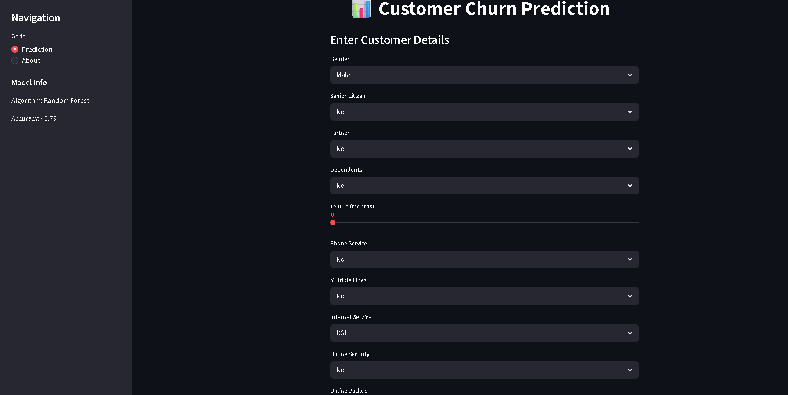
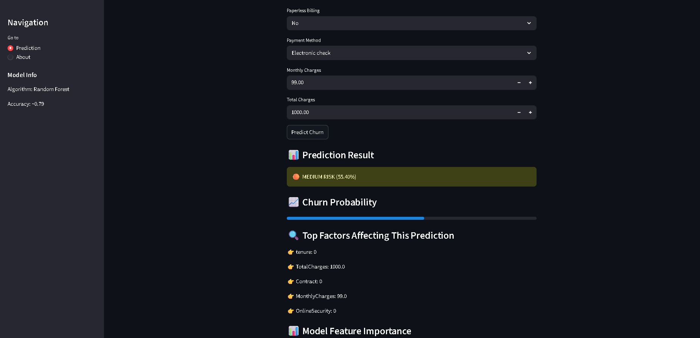
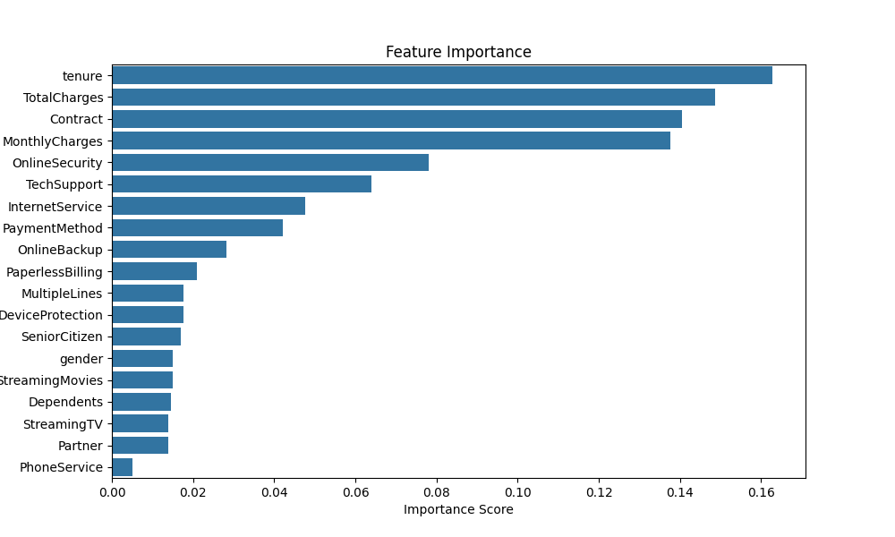
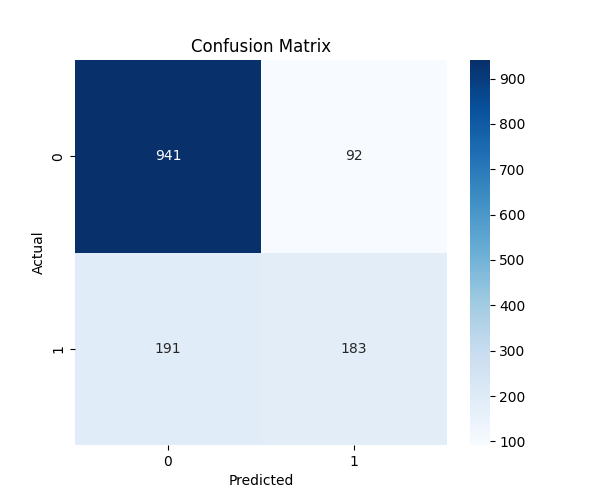
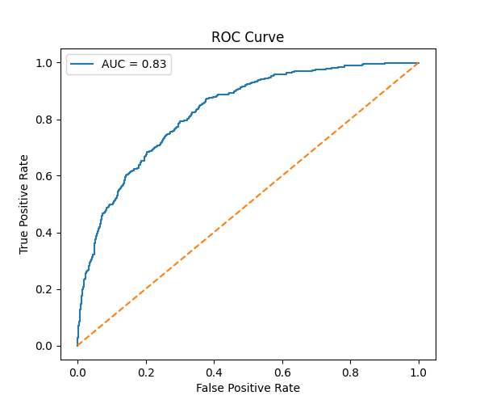

# 📊 Customer Churn Prediction System

🌐 **Live App:**
👉 https://customer-churn-prediction-a2avw7zrrrjazu2swuyahj.streamlit.app/

💻 **GitHub Repository:**
👉 https://github.com/Vayu-143/Customer-Churn-Prediction

---

## 🚀 Project Overview

This project is an **end-to-end Customer Churn Prediction system** built using Machine Learning and deployed as an interactive web application.

It predicts whether a customer is likely to churn and provides:

* 📊 Risk level (Low / Medium / High)
* 🔍 Feature importance explanation
* 💡 Business recommendations
* 📁 Prediction history tracking

---

## 🎯 Business Problem

Customer churn is a critical issue in industries like telecom, banking, and SaaS.

Losing customers leads to:

* 📉 Revenue loss
* 💸 Increased acquisition cost
* ⚠️ Reduced customer lifetime value

👉 This system helps businesses **identify high-risk customers early and take action**.

---

## 🧠 Machine Learning Workflow

```
Customer Data → Preprocessing → Feature Engineering → Model Training → Prediction → Insights
```

---

## ⚙️ Tech Stack

* **Python**
* **Pandas, NumPy**
* **Scikit-learn (Random Forest)**
* **Matplotlib, Seaborn**
* **Streamlit (Web App)**

👉 Streamlit allows building interactive ML apps quickly from Python scripts ([GitHub][1])

---

## 📊 Model Performance

* **Algorithm:** Random Forest
* **Accuracy:** ~79%
* **Evaluation Metrics:**

  * Confusion Matrix
  * Classification Report
  * ROC Curve

---

## 🔥 Key Features

### ✅ 1. Churn Prediction

* Predicts if a customer will churn
* Displays probability score

---

### 📊 2. Risk Level Classification

* 🔴 High Risk (>80%)
* 🟠 Medium Risk (50–80%)
* 🟢 Low Risk (<50%)

---

### 🔍 3. Explainable AI

* Shows **top factors affecting prediction**
* Feature importance visualization

---

### 💡 4. Business Recommendations

* Suggests actions like:

  * Offer discounts
  * Customer engagement
  * Retention strategies

---

### 📁 5. Prediction History

* Stores previous predictions
* Displays recent predictions in dashboard

---

### 📥 6. Download Report

* Export prediction results as CSV

---

## 📸 Project Screenshots

### 🔹 App Interface



### 🔹 Prediction Output



### 🔹 Feature Importance



### 🔹 Confusion Matrix



### 🔹 ROC Curve



---

## 🗂️ Project Structure

```
Customer-Churn-Prediction/
│
├── data/
├── models/
│   └── model.pkl
│
├── src/
│   ├── data_preprocessing.py
│   ├── train_model.py
│   ├── visualization.py
│
├── images/
│
├── app.py
├── main.py
├── requirements.txt
└── README.md
```

---

## ▶️ How to Run Locally

### 1️⃣ Clone the repository

```bash
git clone https://github.com/Vayu-143/Customer-Churn-Prediction.git
cd Customer-Churn-Prediction
```

### 2️⃣ Install dependencies

```bash
pip install -r requirements.txt
```

### 3️⃣ Train model

```bash
python main.py
```

### 4️⃣ Run Streamlit app

```bash
streamlit run app.py
```

---

## 🌐 Deployment

This app is deployed using **Streamlit Cloud**, enabling real-time access from anywhere.

👉 https://customer-churn-prediction-a2avw7zrrrjazu2swuyahj.streamlit.app/

---

## 🧠 Key Learnings

* End-to-end ML pipeline development
* Handling categorical encoding & feature consistency
* Model evaluation techniques
* Building interactive dashboards with Streamlit
* Debugging real-world ML deployment issues

---

## 📌 Future Improvements

* 🔥 Add SHAP explainability
* 📊 Dashboard analytics
* 🌐 API integration (FastAPI)
* 🗄️ Database storage (instead of CSV)
* 🚀 Docker deployment

---

## 👨‍💻 Author

**Vayunandan Mishra**

---

## ⭐ Support

If you found this project useful:

👉 ⭐ Star this repository
👉 Share it with others

---

[1]: https://github.com/streamlit/streamlit?utm_source=chatgpt.com "Streamlit — A faster way to build and share data apps."
